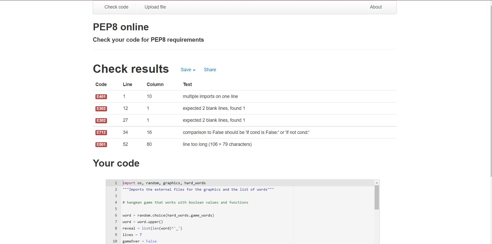
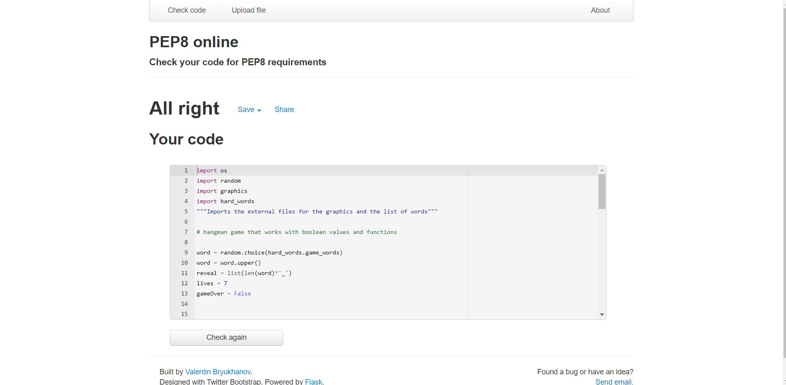

# About 
This is a hangman game built using python to be played in the command line. This game uses if statements, while loops and for loops. Functions are used to run the game and there are addiotional files used for the graphics of the game and the list of words that are imported.
# Languages 
- Python

# Validator testing
When testing through pep8online I found a few errors that related to indentation and syntax.

No errors were found I've corrected them.

# Bug report
Currently the graphics arent showing up properly on the game and the hangman word is being shown too early therefore spoiling the game.

# Deployment
Heroku.com

# Credits
hangmanwords.com - words